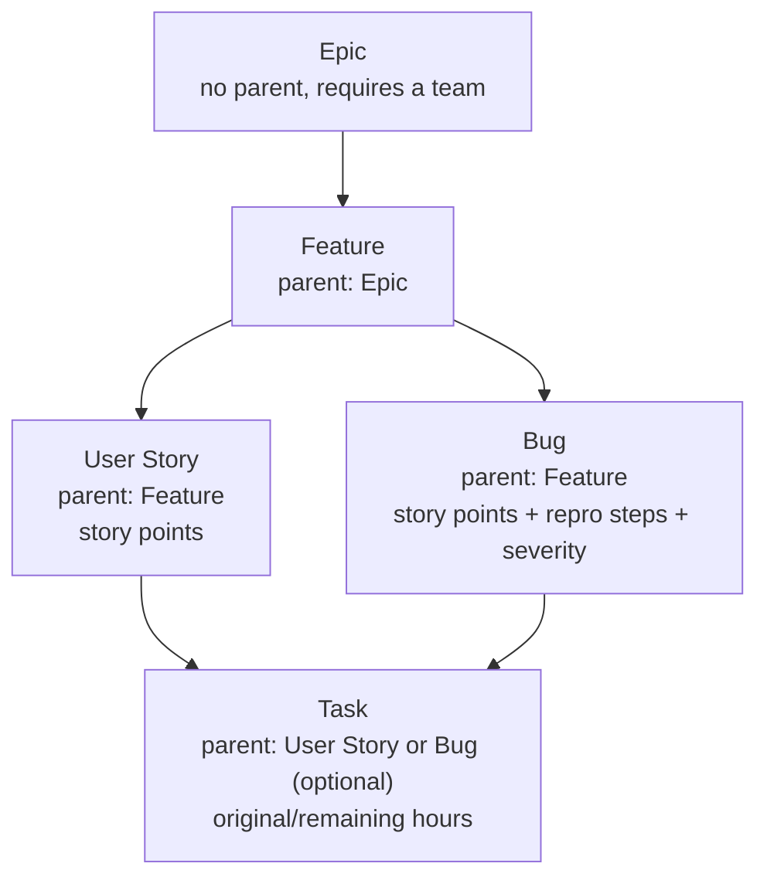

<!-- markdownlint-disable MD033 -->

# Native sprint planning

**Inspired by Azure DevOps Boards. Nothing leaves TaskFlow.**

This document explains what was built, why it looks the way it does, where
it lives in the codebase, and how to use it — for anyone picking this area
up next.

## The one-sentence version

TaskFlow doesn't connect to a real Azure DevOps account. It borrows the
*shape* of Azure Boards — a ranked backlog, a typed work-item hierarchy,
delivery teams — and rebuilds that shape natively on TaskFlow's own `tasks`
table, so a planning item is never more than a specially-shaped task.

## Why "native" and not a connection

The first attempt at this area was a literal integration: OAuth into a real
Azure DevOps organization, sync its boards over the wire. That version
shipped, then got fully reverted. The requirement was never to talk to
Azure DevOps — it was to give TaskFlow *equivalent* capability, owned
end-to-end, with no external account and no data ever leaving the app. Once
that was clear, the two increments below were designed and built from a
clean slate.

## What maps to what

| Azure DevOps concept | TaskFlow equivalent | Notes |
| --- | --- | --- |
| Team project / Area | Planning team | Owns a backlog, its own members, its own sprint cadence |
| Epic → Feature → User&nbsp;Story → Task | `epic` → `feature` → `user_story`/`bug` → `task` | Same four-plus-one depth, enforced by a database trigger, not app code |
| Bug (Agile process template) | `bug` work-item type | Sibling of User Story: child of Feature, can parent Tasks, carries repro steps + severity + found-in-build |
| Backlog (ranked, drag-to-reorder) | Ranked backlog tree | Fractional/lexicographic ranking — the same technique Trello and Jira use |
| Story points / original-remaining hours | `story_points` / `original_hours` + `remaining_hours` | Points for everything above Task; hours for Task only, mutually exclusive by type |
| Move to another team/area | Move & reparent dialog | Cross-team moves cascade the whole subtree, gated behind a live descendant-count preview |
| Iterations / Sprints, Boards, Burndown, Bugs-as-triage, Releases | *Not yet built* | Roadmap below — this doc covers increments 1–2 only |

## Architecture in five decisions

**1. Extend the `tasks` table, don't replace it.**
A planning item is a row in the same `tasks` table every other TaskFlow
feature already reads and writes. It just optionally carries a
`work_item_type`, a `parent_task_id`, a `planning_team_id`, and some
estimate columns. Existing task behavior — assignments, comments,
checklists, activity, notifications — comes along for free, unchanged.

**2. Cycles are structurally impossible, not tested-against.**
One `BEFORE INSERT OR UPDATE` trigger,
`validate_work_item_hierarchy()`, is the single source of truth for which
parent/child type pairs are legal. Every edge strictly decreases a fixed
type rank (Epic → Feature → {User Story, Bug} → Task), so no code path —
present or future — can construct a loop. The trigger fires no matter which
function writes the row.

**3. Structurally sensitive columns have no direct grant.**
`work_item_type`, `parent_task_id`, `planning_team_id`, `backlog_rank`, and
`original_hours` are never granted to `authenticated`. Every write to them
goes through a `SECURITY DEFINER` RPC (`create_work_item`, `move_work_item`,
`assign_backlog_rank`, `reestimate_work_item_hours`, …) that validates the
caller's access, then writes as the function owner. There is no direct-SQL
path around the business rules, even if a Row-Level Security policy were
ever misconfigured. Ordinary fields — `title`, `story_points`,
`repro_steps`, `severity` — are plain grants gated by RLS, because nothing
about them needs that extra indirection.

**4. Ranking is fractional, not integer.**
`backlog_rank` is a base62 string (`0-9A-Za-z`). Moving an item between two
neighbors computes a new string that sorts between them — no renumbering
every other sibling. The same digit-gap-walk algorithm is implemented twice
byte-for-byte: once in Postgres (`backlog_rank_midpoint`) as the source of
truth, once in TypeScript (`src/modules/backlog/rank.ts`) for instant
optimistic UI. When precision runs out, a bounded rebalance
(`rebalance_backlog_siblings`) reassigns the whole sibling set to evenly
spaced ranks and the caller retries exactly once.

**5. Reparenting cascades on purpose, but only when asked.**
Moving an item within its own team never touches its descendants — they
already point at their own direct parent. Moving it to a *different* team
does, because "parent and child share a team" is an invariant: every
transitive descendant's `planning_team_id` moves too, in one transaction,
but only once the caller has explicitly acknowledged how many rows that
touches (`includeDescendants`, gated behind a live count from
`count_work_item_descendants`).

## The hierarchy

A bare `task` with no parent and no team is still legal — that's every
task TaskFlow had before this feature existed. Planning is additive, never
a migration.

## Where it lives

| Layer | Path | What's there |
| --- | --- | --- |
| Migrations | `supabase/migrations/202608100001_sprint_foundation.sql` | Planning teams, membership, capacity |
| | `supabase/migrations/202608120001_work_item_hierarchy_and_backlog.sql` | Hierarchy, ranking, estimates, RPCs |
| | `supabase/migrations/202608130001_bug_work_item_type_enum.sql` + `…002_bug_work_item_type.sql` | The `bug` type (split in two — see below) |
| Database tests | `supabase/tests/sprint_foundation_rls.test.sql` | pgTAP: teams, membership, capacity RLS |
| | `supabase/tests/work_item_hierarchy_rls.test.sql` | pgTAP: hierarchy matrix, ranking, grants, bug fields — 275 assertions |
| Backend | `src/modules/planning-teams/` | Team CRUD, membership, capacity (`queries.ts`, `actions.ts`, `schemas.ts`) |
| | `src/modules/backlog/` | `queries.ts` (tree fetch, filters, candidates), `actions.ts` (create/update/move/rank), `schemas.ts` (Zod), `rank.ts` (pure ranking algorithm) |
| Routes | `/planning` | Landing page, team list |
| | `/planning/teams/[teamId]` | Team settings, members, capacity |
| | `/planning/teams/[teamId]/backlog` | The ranked backlog tree |
| UI | `src/components/planning/backlog/` | `backlog-tree.tsx` (state, drag-and-drop, optimistic updates), `backlog-row.tsx` (one row), `backlog-filters.tsx`, `create-work-item-form.tsx`, `move-work-item-dialog.tsx`, `bug-details-dialog.tsx`, `tree-utils.ts` (pure tree math) |
| | `src/app/(app)/tasks/[taskId]/page.tsx` | Read-only "Bug details" card, shown when a task is a bug |
| Acceptance tests | `tests/e2e/planning-teams.spec.ts`, `tests/e2e/planning-backlog.spec.ts` | Full Playwright flows, including a cross-org visibility proof |

*Why the bug migration is split in two:* Postgres won't let a `CHECK`
constraint or trigger body reference a brand-new enum value in the same
transaction that adds it. `…_enum.sql` adds `'bug'` to `work_item_type` and
commits; `…_bug_work_item_type.sql` then safely references it.

## How to use it

### 1. Turn it on

The whole area is behind the `native_sprint_planning` feature flag — on by
default in `development`, off in `staging`/`production` until an approved
rollout (see `docs/operations/feature-flags.md`). With it enabled, a
**Planning** link appears in the main navigation for every signed-in user.

### 2. Create a planning team

`/planning/teams` → **Create team**. Set a name, an optional description,
and a default sprint length (used by later increments, not yet by the
backlog). Add members and each one's daily capacity from the team page —
admins can manage any team; planners can manage their own.

### 3. Build the backlog

From a team page, **View backlog** opens `/planning/teams/[teamId]/backlog`.

- **New epic** — the only way to start a tree; epics have no parent.
- **+ under a row** — adds the one legal child type for that row (a Feature
  under an Epic, a Task under a User Story or Bug). A **Feature** row has
  *two* legal child types, so its `+` opens a small menu: *Add user story*
  or *Add bug*.
- Filing a bug asks for the same fields as any other item, plus **repro
  steps**, **severity**, and an optional **found-in-build** note.

### 4. Estimate

Click the estimate chip on any row. Everything above Task gets **story
points**; Task gets **original/remaining hours**. The two are mutually
exclusive by type — the form (and the database) won't let you set both.

### 5. Reorder

Two ways, same underlying rank call: the ↑/↓ buttons on each row (the
primary, keyboard-reachable path), or drag a row by its grip handle and
drop it on another row in the same scope — the dropped item lands
immediately above the one it was dropped on.

### 6. Move or reparent

The move icon on a row opens a dialog scoped to what that row actually is:

- **Epic** — pick a destination **team** directly (epics have no parent).
- **Feature / User Story / Bug / Task** — pick a new **parent**; the
  destination team is implied by whichever team that parent belongs to.

If the move crosses a team boundary *and* the item has descendants, the
dialog shows a live count and requires an explicit checkbox before the
**Move** button enables. Same-team reparenting never shows that gate —
descendants aren't affected by it.

### 7. Edit a bug after filing it

The bug icon on a bug row opens **Bug details** — repro steps, severity,
and found-in-build, editable by anyone on the planning team (not just
admins). The same three fields also render read-only on that item's normal
task detail page (`/tasks/[taskId]`), since every planning item is still an
ordinary task underneath.

## Filters

The backlog toolbar filters by type, assignee, estimate state
(estimated/unestimated), and free text. Filtering never breaks the tree:
if a filter matches only a deeply nested item, every ancestor down to that
match stays visible so the hierarchy still makes sense.

## Security model, in practice

Visibility follows planning-team membership, layered on top of (never
replacing) TaskFlow's existing task visibility. An org admin sees every
team implicitly; an explicit team member sees that team's items; anyone
else — reachable route, empty backlog — sees nothing, proven directly by
an e2e test that signs in as an outside org member and asserts the titles
never render.

## What's next

The design spec
(`docs/superpowers/specs/2026-08-10-native-sprint-planning-design.md`)
lays out eight increments; two are shipped, this bug type is a
between-increment addition:

1. ✅ Database foundation, RLS, planning teams
2. ✅ Work-item hierarchy, estimates, ranked backlog *(+ Bug type)*
3. ⏳ Sprint lifecycle, capacity, planning workspace
4. ⏳ Active sprint board, assignment roll-ups
5. ⏳ Burndown, velocity, forecasts
6. ⏳ Risks, review, retrospective, action items
7. ⏳ Releases, cross-team roadmap
8. ⏳ Accessibility polish, full e2e coverage, rollout

## For contributors: the testing shape

Every change in this area follows the same red-green rhythm:

1. **pgTAP first** (`supabase/tests/work_item_hierarchy_rls.test.sql`) —
   schema, hierarchy matrix, grants, RLS. Run red, then implement the
   migration to green (`npm run db:reset && npm run db:test`).
2. **Unit tests** alongside each module (`tests/unit/backlog-*.test.ts`) —
   schemas, queries, actions, and components, each mocked at the module
   boundary.
3. **One acceptance spec** (`tests/e2e/planning-backlog.spec.ts`) that
   exercises the real thing end to end against local Supabase — no mocks.

A few sharp edges worth knowing if you're extending this:

- Postgres requires every function parameter after the first one with a
  `default` to also have one — RPC signatures are ordered accordingly, and
  `create_work_item`'s bug-field params landed at the very end for exactly
  this reason.
- `backlog_rank` is declared `collate "C"` at the *column* level, not just
  in the unique index. Without that, an unqualified `ORDER BY` from
  PostgREST sorts case-insensitively and silently breaks rank order the
  first time a rebalance produces a mix of upper- and lower-case digits —
  a real bug this area's own acceptance test caught.
- Adding a new enum value and referencing it in the same migration
  transaction raises "unsafe use of new value of enum type." Give the
  `ALTER TYPE ... ADD VALUE` its own migration file.
