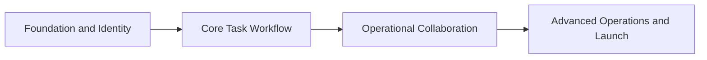

# Task Management Platform Delivery Roadmap

This roadmap decomposes the approved engineering specification into four executable implementation plans. Each plan ends in working, testable software and must pass the release gates in the specification before the next plan begins.

## Plan sequence

1. **Foundation and Identity** — Next.js toolchain, Supabase local development, organizations, profiles, memberships, invitations, server authorization, application shell, feature flags, telemetry, seed data, and Phase 0 gates.
2. **Core Task Workflow** — tasks, independent assignments, state machine, progress, delay reasons, publication, post-publication edits, acknowledgements, activity events, core in-app notifications, My Tasks, task detail, and the Phase 1 end-to-end workflow.
3. **Operational Collaboration** — Admin dashboard, My Day, list/board/calendar views, filters, discussions, mentions, reminders, overdue processing, employee directory, notification center, responsive and accessibility hardening, and Phase 2 gates.
4. **Advanced Operations and Launch** — private attachments, email grouping/quiet hours, recurrence, reports/CSV, retention/export, support tools, observability dashboards, backup restoration, performance tests, pilot acceptance, and production launch gates.

## Dependency map

## Coverage contract

| Specification area | Owning plan |
| --- | --- |
| Architecture, modules, naming, coding standards | Foundation and Identity |
| Authentication, organizations, roles, permissions foundation | Foundation and Identity |
| Safe migrations, environments, seed organization, feature flags | Foundation and Identity |
| Task/assignment model and state machine | Core Task Workflow |
| Task editing, acknowledgements, activity history | Core Task Workflow |
| Realtime assignment/completion notifications | Core Task Workflow |
| Admin/employee core navigation and responsive task flow | Core Task Workflow |
| Dashboard, My Day, views, filters, directory | Operational Collaboration |
| Threaded discussion, mentions, notification preferences | Operational Collaboration |
| Deadline reminders and automatic overdue handling | Operational Collaboration |
| Files, email, recurrence, reports and exports | Advanced Operations and Launch |
| Retention, support tools, recovery, performance and pilot | Advanced Operations and Launch |

The implementation-plan file for the first segment is `docs/superpowers/plans/2026-08-01-foundation-and-identity.md`. Later detailed plans are written at the preceding release checkpoint so they incorporate verified APIs and schema rather than guessing about code that does not yet exist.
