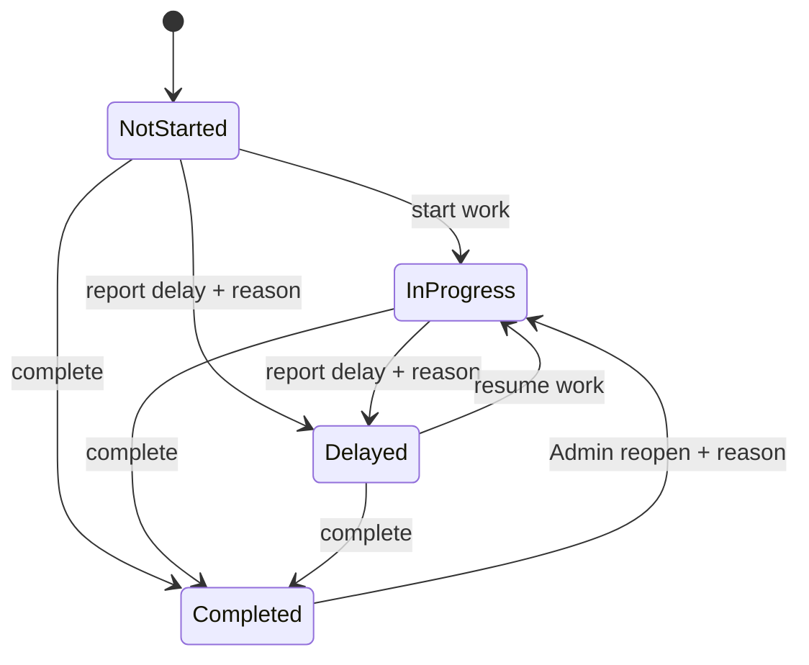
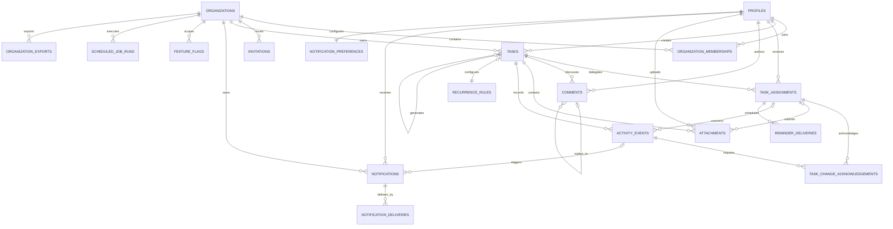

# Task Management Platform Design

Date: 2026-08-01
Status: Approved product design

## 1. Purpose

Build a secure, responsive task-management web application for founders/managers and employees/interns. Admins assign and oversee work; employees manage their own assignments, progress, delays, files, and discussions. The product combines the clarity of Google Classroom's assignment lifecycle with the operational task views of Microsoft Planner in Teams, while retaining original branding and interaction design.

## 2. Product assumptions

- The initial deployment serves one organization and fewer than 500 users, while all organization-owned records include an organization boundary so multi-tenant support can be added safely.
- Registration is invitation-only. Users cannot grant themselves the Admin role.
- Employees can access only tasks assigned to them. Admins can access all records in their organization.
- Multiple admins are supported.
- The default organization timezone is Asia/Kolkata and can be changed by an admin.
- English is the initial interface language.
- Both in-app and email notifications are in scope.
- Third-party collaboration integrations such as Slack, Google Workspace, and Microsoft 365 are outside the initial build.
- All three phases in the source requirements are included, delivered as independently testable milestones.

## 3. Product principles

1. Assignment lifecycle first: creating, understanding, progressing, discussing, and completing work must remain obvious.
2. Personal focus for employees: My Day and My Tasks prioritize actionable work without exposing colleagues' assignments.
3. Operational visibility for admins: dashboards, filters, workload, deadlines, and reporting make problems visible early.
4. Durable accountability: task changes, comments, notifications, and delivery attempts survive refresh and are auditable.
5. Mobile parity: core employee actions must work comfortably on a phone.
6. Accessible by default: semantic controls, keyboard navigation, visible focus, sufficient contrast, and clear error messaging are required.

## 4. Selected architecture

Use a TypeScript Next.js application backed by Supabase services:

- Next.js supplies the responsive web interface, server-rendered pages, server-side actions, and protected API boundaries.
- PostgreSQL stores organizations, identities, tasks, assignments, conversations, audit events, recurrence rules, notifications, and reporting data.
- Supabase Auth manages authentication, invitations, verification, sessions, and password recovery.
- Row-level security enforces organization and role boundaries at the database layer.
- Supabase Realtime delivers near-realtime task and notification updates.
- Private object storage holds task reference files and employee deliverables. Access uses short-lived signed URLs.
- Scheduled server jobs create recurring work, detect overdue assignments, and enqueue reminders.
- A transactional email provider sends queued email notifications. Provider-specific code remains behind a notification adapter.
- Vercel hosts the application, while Supabase hosts the managed database, authentication, realtime, and storage services.

This architecture is preferred over a separate custom API/worker stack because it meets the expected scale with substantially less operational complexity. It is preferred over Firebase because the domain is relational and requires aggregation-heavy reporting and strict row-level access rules.

### Application module boundaries

The codebase is organized by domain rather than by page alone. Each module owns its validation, server operations, data access, domain types, tests, and module-specific interface components. Shared infrastructure is accessed through narrow adapters.

| Module | Owns | Depends on |
| --- | --- | --- |
| Authentication | Session handling, sign-in, recovery, invitation acceptance | Supabase Auth, Organizations |
| Organizations | Organization settings, timezone, retention policy | Authentication |
| Members | Memberships, roles, invitations, deactivation | Authentication, Organizations, Notifications |
| Tasks | Task intent, drafts, publication, edits, recurrence configuration | Organizations, Members, Files, Activity |
| Assignments | Assignees, status, progress, delay, completion, acknowledgements | Tasks, Members, Activity, Notifications |
| Discussions | Comments, replies, mentions, moderation | Tasks, Members, Notifications, Activity |
| Files | Upload authorization, metadata, quotas, signed access, quarantine | Tasks, Assignments, Activity, Storage adapter |
| Notifications | Durable inbox, preferences, grouping, delivery attempts | Members, Email and realtime adapters |
| Reports | Read-only metrics, exports, workload views | Tasks, Assignments, Members |
| Operations | Jobs, feature flags, telemetry, support tools, recovery checks | All modules through explicit service interfaces |

Modules do not import another module's internal repository or database helpers. Cross-module writes use exported services so authorization, events, and transaction rules cannot be bypassed. Shared code is limited to design primitives, typed errors, database/client factories, time utilities, and infrastructure adapters.

### Server operation boundaries

Next.js Server Actions are the primary mutation interface. Query services run on the server and return role-filtered view models. Route handlers are reserved for file transfer, scheduled jobs, exports, authentication callbacks, and external webhooks. All inputs use shared schemas; authorization is repeated server-side; multi-record mutations are transactional; and actions return a typed success or safe error result containing a trace ID.

| Module | Server operations |
| --- | --- |
| Members | `inviteMember`, `resendInvitation`, `changeMemberRole`, `deactivateMember`, `reactivateMember` |
| Tasks | `createTask`, `updateTask`, `publishTask`, `scheduleTask`, `archiveTask`, `updateRecurrence`, `acknowledgeTaskChange` |
| Assignments | `updateAssignmentProgress`, `changeAssignmentStatus`, `adminOverrideAssignment`, `reopenAssignment` |
| Discussions | `createComment`, `editOwnComment`, `moderateComment`, `setTaskThreadMuted` |
| Files | `createUploadIntent`, `finalizeUpload`, `removeAttachment`, `createSignedDownload` |
| Notifications | `markNotificationRead`, `markAllNotificationsRead`, `updateNotificationPreferences` |
| Reports | `getDashboardSummary`, `getWorkloadReport`, `getCompletionReport`, `createOrganizationExport` |
| Operations | `retryNotificationDelivery`, `setFeatureFlag`, `runRetentionDryRun`, `deactivateCompromisedAccount` |

Protected route handlers are:

- `POST /api/uploads/sign` and `POST /api/uploads/complete` for validated direct storage uploads.
- `GET /api/files/:attachmentId` for authorized short-lived download redirection.
- `GET /api/exports/:exportId` for authorized export download.
- `POST /api/jobs/reminders`, `/api/jobs/overdue`, `/api/jobs/recurrence`, `/api/jobs/notifications`, and `/api/jobs/retention` for signature-verified, idempotent scheduled execution.
- `GET /auth/callback` for managed authentication completion.

Query services include `listMyDay`, `listMyTasks`, `listOrganizationTasks`, `getTaskDetail`, `listNotifications`, `listMembers`, `getDashboard`, and `getReport`. Each accepts explicit pagination and filter objects; no query service exposes an unrestricted generic database interface.

## 5. Roles and permissions

### Admin

- Invite, deactivate, and manage organization members.
- Grant or remove the Admin role for authorized members.
- Create, draft, schedule, edit, assign, archive, reopen, and recur tasks.
- Access all task assignments, conversations, files, activity events, and reports in the organization.
- Configure organization timezone and default notification settings.

### Employee

- View only tasks assigned to them.
- Change their assignment status and progress.
- Supply a required reason when declaring a delay.
- Add comments, replies, mentions, and permitted attachments.
- Complete their assignment and view its activity history.
- Manage personal notification preferences and profile details.

Every privileged operation is authorized on the server and reinforced by database policy. Hiding an interface control is never treated as authorization.

### Permissions matrix

| Operation | Admin | Assigned employee | Other employee |
| --- | --- | --- | --- |
| View task and shared reference files | Yes | Yes | No |
| Create, publish, edit, archive, or recur a task | Yes | No | No |
| Add or remove assignees | Yes | No | No |
| View all assignee progress | Yes | Own assignment only | No |
| Change assignment progress or status | Yes, with mandatory override reason | Yes, for own assignment | No |
| Mark assignment delayed or complete | Yes, with mandatory override reason | Yes, for own assignment | No |
| Reopen completed assignment | Yes | No | No |
| View task activity | Yes | Events visible for shared task and own assignment | No |
| Post a task comment or reply | Yes | Yes | No |
| Edit own comment | Yes | Yes | No |
| Moderate another user's comment | Yes, with reason and audit event | No | No |
| Upload or remove task reference attachment | Yes | No | No |
| Upload own deliverable | Yes, on behalf of assignee with reason | Yes, before completion | No |
| Remove deliverable | Yes, with reason | Yes, before completion | No |
| Download own deliverables | Yes | Yes | No |
| View organization reports or directory | Yes | No | No |
| Manage members, roles, settings, or retention | Yes | No | No |

An Admin override never impersonates an employee: the Admin remains the recorded actor, supplies a reason, and triggers an employee notification. After completion, employee deliverables are locked; removal requires an Admin action and leaves an attachment tombstone in the activity history.

## 6. Task and assignment model

A task stores shared intent: title, description, creator, priority, schedule, deadline, reference attachments, and recurrence configuration. Assigning the task creates one task-assignment record per employee.

Each assignment independently stores status, progress, delay reason, started time, completed time, and assignee-specific deliverables. Therefore, one employee completing a task does not complete it for other assignees. Admin views show a parent rollup such as "2 of 3 completed."

Supported employee statuses are:

- Not Started
- In Progress
- Delayed
- Completed

Progress uses 0, 25, 50, 75, or 100 percent. Starting work moves a zero-progress assignment to In Progress. Completing sets progress to 100. Moving to Delayed requires a non-empty reason. Reopening a completed assignment is an Admin action and creates an audit event.

Overdue is a computed condition, not a manually selected status. An incomplete assignment is overdue when the deadline has passed in the organization's timezone. This permits meaningful combinations such as In Progress + Overdue and Delayed + Overdue.

### Assignment state machine



| Current state | Allowed next state | Employee | Admin | Constraints |
| --- | --- | --- | --- | --- |
| Not Started | In Progress | Yes | Override | Progress becomes at least 25 |
| Not Started | Delayed | Yes | Override | Non-empty delay reason required; progress remains 0 |
| Not Started | Completed | Yes | Override | Progress becomes 100 |
| In Progress | Delayed | Yes | Override | Non-empty delay reason required |
| In Progress | Completed | Yes | Override | Progress becomes 100 |
| Delayed | In Progress | Yes | Override | Delay reason remains in history; current reason clears |
| Delayed | Completed | Yes | Override | Progress becomes 100 |
| Completed | In Progress | No | Yes | Reopen reason required; progress becomes 75 unless Admin selects a lower permitted value |

An Admin "Override" uses the same target transition but requires a reason and employee notification. No actor can move started work back to Not Started. In Progress permits progress 25, 50, or 75; Delayed permits 0, 25, 50, or 75; Completed requires 100. Attempts outside this table are invalid even if submitted directly to a server action.

## 7. User flows

### Admin assignment flow

1. Admin opens Create Task.
2. Admin enters a title, detailed instructions, assignees, priority, deadline, optional start date, reference files, reminders, and optional recurrence.
3. Admin saves a draft, schedules publication, or assigns immediately.
4. Publication creates assignment records, activity events, and durable notifications in one consistent operation.
5. Realtime delivery updates connected employees; queued email delivery serves users who are offline.
6. Admin follows aggregate and individual progress from the dashboard or task detail.

### Employee work flow

1. Employee sees a realtime alert and unread bell count.
2. Employee opens the linked task and reviews instructions, due date, and reference files.
3. Employee starts the task, adjusts progress, posts updates or blockers, and uploads deliverables.
4. If delayed, the employee selects Delayed and provides the required explanation.
5. Employee marks the assignment complete. The action sets progress to 100, records completion time, creates an activity event, and notifies admins.

### Discussion flow

Comments form a chronological task thread with replies and mentions. Comments are durable and attributed. Rather than silently deleting or rewriting accountability records, edited comments retain edit metadata and deleted comments retain an audit-visible tombstone. Mentioned users and relevant participants receive notifications subject to their preferences.

### Post-publication task edits

Every published-task edit records before/after values in an activity event. The following rules apply:

| Change | Result |
| --- | --- |
| Deadline moved earlier | Notify incomplete assignees immediately; require acknowledgement by default only from assignees who already started |
| Deadline moved later | Notify incomplete assignees; no acknowledgement by default |
| Material instruction change | Notify incomplete assignees; require acknowledgement by default only from assignees who already started |
| Priority change | Notify incomplete assignees; no acknowledgement by default |
| Assignee added | Create a new independent assignment and send a new-assignment notification |
| Assignee removed | Revoke future access, preserve historical attribution, and notify the removed employee |
| Reference attachment added, replaced, or removed | Notify incomplete assignees; Admin can mark the change as requiring acknowledgement |
| Recurrence changed | Apply only to future occurrences after Admin confirms the effective date |

"Material instruction change" means an edit that changes the requested outcome, acceptance criteria, or required work rather than spelling or formatting. The edit dialog requires the Admin to classify an instruction edit as material or minor and records that choice. An assignment counts as started when its status is In Progress or Delayed, its progress is greater than zero, or it has a recorded `started_at` value. Not Started assignees receive the notification without acknowledgement friction. For started work, the Admin can disable acknowledgement for that individual edit but must supply a reason, which is audited. A required acknowledgement appears as a prominent task-detail banner but does not prevent employees from accessing or updating their work. Admins can see acknowledgement state per assignee.

## 8. Information architecture

### Shared screens

- Login, password recovery, invitation acceptance, and initial organization setup
- Task detail
- Notifications center
- Profile and notification preferences

### Admin screens

- Dashboard
- All Tasks with list, board, and calendar views
- Create/Edit Task
- Employee Directory and employee workload detail
- Reports
- Organization settings

### Employee screens

- My Day
- My Tasks with list, board, and calendar views
- Task detail

Desktop navigation uses a persistent sidebar. Mobile uses a compact header and bottom navigation for primary destinations. Secondary information in the desktop task view becomes vertically stacked content on mobile.

### Navigation and route map

```text
Public
├── /login
├── /forgot-password
├── /reset-password
└── /invite/[token]

Admin application
├── /dashboard
├── /tasks
│   ├── /new
│   └── /[taskId]
├── /employees
│   └── /[memberId]
├── /reports
├── /notifications
└── /settings
    ├── /organization
    ├── /members
    ├── /notifications
    └── /operations

Employee application
├── /my-day
├── /my-tasks
│   └── /[taskId]
├── /notifications
└── /profile
```

Role-aware navigation hides destinations the session cannot access, while route guards and row-level policies enforce the same boundary. Shared task URLs resolve through one canonical task-detail route internally; the role-specific paths above describe the visible navigation context rather than duplicating task-detail implementations.

## 9. Key screen behavior

### Admin dashboard

Display total active, due today, overdue, delayed, and completed-this-month metrics; completion trends; task distribution; employee workload; attention items; and recent activity. Every metric links to its filtered source records.

### My Day

Show overdue assignments first, followed by work due today and upcoming high-priority assignments. Recently assigned work appears as a secondary section.

### Task views

Provide:

- Grid/list view for scanning and quick field comparison.
- Board view grouped by status with authorized drag transitions.
- Calendar view based on start and due dates.
- Search by task text and filters for status, assignee, priority, deadline, overdue state, and creator.

The application remembers each user's last view and filter preferences.

### Task detail

Show summary, deadline, priority, instructions, assignee rollup, individual progress, attachments, discussion, delay information, and immutable activity history. Controls reflect the viewer's role and assignment relationship.

## 10. Data model

Core tables are:

- `organizations`
- `profiles`
- `organization_memberships`
- `invitations`
- `tasks`
- `task_assignments`
- `task_change_acknowledgements`
- `comments`
- `attachments`
- `activity_events`
- `notifications`
- `notification_deliveries`
- `notification_preferences`
- `recurrence_rules`
- `reminder_deliveries`
- `feature_flags`
- `scheduled_job_runs`
- `organization_exports`

### Domain relationship diagram



`organization_id` is retained directly on security-sensitive child tables even where it can be derived through a parent. This supports simple, auditable row-level policies and prevents authorization from depending on long or nullable join chains.

All organization-owned records contain `organization_id`. Mutable records use creation and update timestamps. Records needed for accountability are archived or deactivated rather than hard-deleted. Activity events are append-only and include actor, event type, subject, timestamp, and structured change metadata.

### Migration and environment strategy

- Development, staging, and production use separate Supabase projects, storage buckets, secrets, and email configurations.
- Database changes are versioned migrations committed with the application.
- Migrations are reversible where data safety permits. Irreversible transformations use additive schema changes, backfills, verification, and a later cleanup release.
- Continuous integration applies all migrations to a fresh database and upgrades a copy of the previous schema before merge.
- Production deployment creates or verifies a restorable backup, runs preflight checks, applies migrations once, validates health, and then promotes application traffic.
- Automated checks reject destructive statements against protected tables unless an explicitly reviewed migration waiver and recovery procedure are present.
- Seed data is synthetic and contains no real employee information.
- A deterministic demo organization includes Admin and Employee accounts, tasks in every status, comments, files, reminders, and reporting history for acceptance testing.

## 11. Notifications and scheduled work

Events can generate notifications for assignment, edits affecting an assignee, reassignment, comments, replies, mentions, deadline reminders, newly overdue work, delay declarations, completion, and reopening.

In-app notifications consist of realtime toasts, an unread bell counter, and a durable notification center with deep links. Email is queued separately, so email provider failure never rolls back a successful task action.

Scheduled processing:

- Sends reminders according to the task reminder configuration.
- Marks each overdue transition once and notifies the configured audience.
- Generates recurring task occurrences.
- Retries failed notification deliveries with bounded backoff.

All jobs use unique delivery or occurrence keys so retries cannot duplicate notifications or tasks.

### Notification policy and anti-noise controls

| Event | In-app | Email default | Grouping and audience |
| --- | --- | --- | --- |
| New assignment | Immediate | Immediate | One notification per task-assignment |
| Deadline moved earlier or material instructions changed | Immediate; acknowledgement for started work unless Admin disables with reason | Immediate | One per task edit, affected assignees only |
| Other task edits | Immediate inbox item | Five-minute grouped digest | Group repeated edits to the same task |
| Mention or direct reply | Immediate | Immediate unless muted | One per mention/reply |
| General thread comment | Immediate inbox item | Five-minute grouped digest | Group by task and recipient |
| Upcoming deadline | Immediate at configured reminder time | Respect quiet hours | One per reminder rule and assignment |
| Newly overdue | Immediate | Respect quiet hours | One per assignment; no repeated daily alert unless configured |
| Employee reports delay | Immediate to Admins | Immediate | One event per assignment transition |
| Employee completes work | Immediate to Admins | Five-minute grouped digest | Combine completions for the same task |
| Admin reopens or overrides work | Immediate to assignee | Immediate | One per action |

Users can mute general thread activity per task, but cannot mute new assignments, required acknowledgements, Admin overrides, or security events. Mentions remain enabled unless the user disables mention email while retaining the in-app record. Email quiet hours are user-configurable and default to 21:00–08:00 in the organization timezone; deferred messages send at the end of quiet hours. In-app records are never delayed.

Notification creation and delivery use stable event and recipient idempotency keys. Grouped emails list individual source events and deep links. Admin completion alerts are summarized per task during the five-minute grouping window instead of generating one email per assignee.

## 12. Recurring work

Support daily, weekly, monthly, and custom interval rules. Each occurrence becomes an ordinary task with independent assignments and history. Editing recurrence offers "this occurrence" or "this and future occurrences." Completed or historical occurrences are never rewritten implicitly.

## 13. Reporting

Admin reports support organization-timezone-aware date filters and optional employee filters. Initial measures are:

- Completed task count by employee
- On-time completion percentage
- Average completion duration
- Delayed and overdue counts
- Current active workload
- Weekly and monthly completion trend
- Priority distribution

CSV export is included. PDF export is deferred because it is not required by the source document.

## 14. Security and privacy

- Invitation-only membership and server-controlled roles
- Verified sessions and secure password recovery
- Row-level organization isolation
- Employee access limited to their assignments and related records
- Private storage and signed file URLs
- Client and server schema validation
- File size, count, and type restrictions
- Rate limits on authentication, invitations, comments, and uploads
- Protected secrets and environment validation
- Audit events for role, membership, task, deadline, assignment, status, and completion changes
- Safe account deactivation and session revocation

### Data retention, deletion, and export

- Active and completed tasks remain available while the organization account is active. Archived tasks remain searchable by Admins for three years, after which an Admin-approved retention job may permanently purge task content while preserving minimal compliance audit metadata.
- Deleted attachments enter a 30-day recoverable quarantine, are inaccessible to ordinary users, and are then permanently removed. Storage backups containing them expire within 35 days.
- Deactivated users remain visible by historical display name in task and activity records. They cannot sign in and receive no notifications.
- A verified account-deletion request immediately deactivates access. After a 30-day recovery and administrative review window, personal profile fields are anonymized unless a documented legal or contractual retention requirement applies. Task authorship is retained under a stable anonymized identity.
- Admins can export organization members, tasks, assignments, comments, activity, and notification metadata in machine-readable form. Private files are delivered in a separately authorized export archive.
- Production database backups are retained for 35 days. Restoration copies and temporary exports are encrypted and destroyed after verification.
- Retention and deletion actions are audit events, require Admin confirmation, and are dry-run reportable before permanent execution.

These are product defaults rather than legal advice. Deployment-specific legal requirements can only extend or override them through a documented organization policy.

## 15. Error handling and consistency

- Optimistic updates roll back when persistence fails and expose a retry action.
- Version checks reject stale concurrent edits instead of silently overwriting newer work.
- Idempotency prevents duplicate task creation from repeated submissions.
- Server rules enforce valid status transitions, mandatory delay reasons, and 100 percent completion.
- Unsupported or oversized files fail before upload when possible and never create dangling attachment records.
- Notification delivery failures are logged and retried without undoing the source action.
- Empty, loading, offline, unauthorized, not-found, and unexpected-error states use clear user-facing guidance.

## 16. Operational reliability and observability

Observability is included in Phase 0. Structured logs, metrics, and error events use a trace/request ID that is returned in user-safe error messages and is searchable by support staff. Telemetry excludes passwords, session tokens, comment bodies, file contents, and unnecessary personal data.

Monitor and alert on:

- Failed logins, invitation acceptance, and suspicious authentication rates
- Failed or slow database operations and row-level-policy denials
- Realtime connection and subscription failures
- Email delivery, bounce, and retry failures
- Scheduled-job failures, stale schedules, and missed execution windows
- Upload failures and storage quota thresholds
- Slow page loads, server actions, and dashboard queries
- Duplicate recurrence or reminder attempts, even when idempotency prevents user-visible duplication

Alerts are severity-classified, include a runbook link, and route to the designated technical owner. Staging verifies that alerts fire without exposing sensitive data.

### Backup and recovery

- Production target recovery point objective: no more than one hour of committed database data loss.
- Production target recovery time objective: restore core login, task, and file access within four hours.
- Database point-in-time recovery and private-file restoration capability are required before production launch.
- Notification and scheduled-job state is stored durably so workers can resume safely after restoration without duplicate delivery.
- A staging recovery exercise occurs before initial launch and at least quarterly thereafter.
- The exercise restores the database, private files, authentication configuration, job schedules, and notification queue into an isolated environment; verifies referential integrity and sample workflows; measures actual RPO/RTO; and records corrective actions.
- Restoration credentials and procedures follow least privilege and are tested without using production user sessions.

### Internal support tools

An audit-protected support area allows specifically authorized Admin/support operators to find a user, task, assignment, notification, or trace by ID; inspect failed email and scheduled-job attempts; retry eligible notification deliveries; deactivate a compromised account; and review storage usage. Support actions require a reason and create an immutable audit event. Support authorization is organization-scoped and never silently bypasses row-level security. Cross-organization platform support, if introduced later, requires explicit time-limited access and user-visible auditing.

### Risk register

| Risk | Impact | Mitigation and detection |
| --- | --- | --- |
| Realtime connection loss | Users miss timely visual updates | Durable notification records, reconnect backoff, stale-connection metric, and 60-second inbox polling fallback while disconnected |
| Email provider outage or bounce | Offline users miss email alerts | Durable queue, bounded retry, provider adapter, bounce monitoring, and visible delivery state in support tools |
| Duplicate reminder or recurrence execution | Duplicate tasks or noisy alerts | Stable idempotency keys, unique database constraints, duplicate-attempt telemetry, and replay tests |
| Large or interrupted uploads | Poor mobile experience or orphaned files | Direct resumable upload where supported, strict quotas, finalize step, checksum verification, and orphan cleanup job |
| Authorization or RLS mismatch | Cross-user or cross-organization exposure | Permissions contract tests at UI/action/database layers, deny-by-default policies, and production security gate |
| Failed or partially applied migration | Outage or data inconsistency | Expand/migrate/contract changes, staging upgrade rehearsal, transaction use where supported, backup, and health-gated rollout |
| Database or audit-table growth | Slow filters and reports | Cursor pagination, bounded queries, targeted indexes, query-plan checks, archival jobs, and storage trend alerts |
| Timezone or scheduler error | Wrong deadlines, reminders, or recurrence | UTC storage, explicit organization timezone conversion, boundary tests, and missed-job monitoring |
| Feature-flag inconsistency | Mixed behavior or inaccessible data | Server-authoritative evaluation, audited changes, tested off-state, and data-compatible rollback behavior |
| Support-tool misuse | Privileged data exposure or destructive action | Organization scoping, least privilege, mandatory reasons, immutable audit events, and elevated-action alerts |

## 17. Performance and capacity budgets

- Primary task pages reach usable interaction within 2.5 seconds at the 75th percentile on a representative mid-range mobile device and typical 4G connection.
- Authenticated server actions complete within 750 milliseconds at the 95th percentile, excluding file transfer and third-party email delivery.
- Normal task filters return within one second at the 95th percentile for an organization with 500 users and 50,000 assignments.
- Realtime notifications become visible within five seconds at the 95th percentile while both clients are connected.
- Dashboard queries are bounded, indexed, and inspected for unbounded sequential scans on high-growth tables.
- Task, notification, activity, comment, directory, and report-detail collections are cursor-paginated. Initial pages contain at most 50 records.
- A file is limited to 25 MB, a task to 250 MB across reference files and deliverables, and an organization to 10 GB by default. Admins see quota warnings at 80 and 95 percent.
- Automated performance checks protect bundle size, representative page speed, query plans, and server-action latency from material regressions.

## 18. Feature rollout controls

Feature flags exist from Phase 0 and are evaluated on the server for authorization-sensitive behavior. Flags support environment, organization, role, and percentage rollout; every change is audited. Recurrence generation, email delivery, board drag-and-drop, reporting, and new permission behavior launch behind flags. Disabling a flag stops new feature actions without hiding or corrupting data already created by that feature. Flags have an owner, purpose, rollout plan, expiry/review date, and tested off-state; they are not permanent configuration substitutes.

## 19. Visual and interaction direction

The interface is an original, modern workplace product rather than a visual clone of an education tool. It uses readable typography, restrained color, clear hierarchy, generous spacing, and consistent status chips. Red is reserved for overdue and destructive/error states. Motion is subtle and functional. Core actions use plain labels such as Assign Task, Start Task, Report Delay, and Mark Complete.

Accessibility requirements include semantic HTML, complete keyboard use, visible focus, screen-reader labels, sufficient contrast, reduced-motion support, and phone-sized touch targets.

### Design system components

Foundation tokens define typography, spacing, radii, elevation, borders, color roles, breakpoints, motion, and focus treatment. Product screens compose these reusable components:

- Application Shell, Sidebar Navigation, Mobile Navigation, Page Header, Breadcrumbs
- Button, Icon Button, Link, Input, Textarea, Select, Combobox, Checkbox, Radio, Switch, Date/Time Picker
- Avatar, Member Picker, Priority Badge, Status Badge, Overdue Indicator, Progress Indicator
- Task Card, Task Grid, Task Board Column, Calendar Task Item, Filter Bar, Sort Menu, Pagination
- Task Composer, Assignee Rollup, Assignment Controls, Required Acknowledgement Banner
- Comment Thread, Comment Composer, Mention Picker, Activity Timeline
- File Upload, Attachment List, Upload Progress, File Preview/Download Action
- Notification Bell, Notification Item, Toast, Notification Preferences
- Metric Card, Report Chart, Data Table, Empty State, Skeleton, Inline Error
- Modal, Confirmation Dialog, Drawer, Popover, Tooltip, Dropdown Menu

Every component specifies variants, sizes, loading/disabled/error states, keyboard behavior, accessible name requirements, and responsive behavior. Domain components consume typed view models and never perform unrestricted database access.

### Engineering and naming standards

- TypeScript uses strict mode with no unchecked `any`; external data is validated at boundaries.
- ESLint, Prettier, type checking, unit tests, and migration checks run in continuous integration. Pre-commit hooks use Husky with lint-staged for fast checks, while CI remains authoritative.
- Database tables, columns, constraints, and SQL functions use `snake_case`. PostgreSQL enums use lower-case string values unless a check constraint is more migration-friendly.
- TypeScript types, React components, and exported classes use `PascalCase`; variables, functions, hooks, action payloads, and JSON fields use `camelCase`; constants use `SCREAMING_SNAKE_CASE` only for true immutable configuration.
- Files use lowercase kebab-case except framework-required names. Tests live next to focused modules or in clearly named integration/end-to-end directories.
- Commits follow Conventional Commits. Branches use `feature/`, `fix/`, `chore/`, or `docs/` plus a concise kebab-case subject.
- Production changes require a reviewed pull request, green required checks, migration notes, screenshots for visual changes, test evidence, security/permissions impact, rollout/flag plan, and rollback notes.
- Domain files remain focused; circular module imports, generic utility dumping grounds, and database access from presentation components are prohibited.

## 20. Release and quality gates

All phases require green continuous integration, successful production build, reviewed migration output, zero open blocker or critical defects, and zero known high-severity authorization, cross-organization exposure, data-loss, or destructive-migration defects. Any exception requires written Product Owner and Technical Owner acceptance with a time-bounded remediation plan; security and data-isolation exceptions cannot be waived for production.

| Phase | Required release evidence |
| --- | --- |
| Phase 0 | Fresh and upgrade migration tests; row-level security tests; authentication/invitation smoke test; secret/dependency/static security scans; observability alert test; backup restore rehearsal in staging |
| Phase 1 | End-to-end assign → start → progress → delay with reason → complete → notify workflow on desktop and mobile; role/permission integration suite; no serious or critical automated accessibility findings on core screens; p75/p95 performance budgets met |
| Phase 2 | Dashboard/filter/board/calendar correctness and performance; reminder/overdue idempotency; threaded discussion and mention tests; keyboard and screen-reader manual review of new workflows |
| Phase 3 | Attachment security and restore test; email retry/grouping/quiet-hour tests; recurrence recovery and duplicate-prevention tests; report reconciliation; retention/export dry run; penetration-style authorization review; pilot acceptance sign-off |

Every phase also requires exploratory testing of changed behavior, responsive checks at representative phone/tablet/desktop widths, and review of new error telemetry in staging. Release approval requires both the Product Owner and Technical Owner. Phase 3 production launch additionally requires designated Admin and Employee pilot representatives to sign off.

Rollback uses a previously verified application deployment plus feature-flag disablement. Database migrations follow expand/migrate/contract so the previous application remains compatible during the rollback window. A release cannot begin without a recorded backup/restore point, rollback owner, health checks, and an explicit threshold for rollback. Data-destructive rollback scripts are never improvised during an incident; recovery uses the rehearsed forward-fix or restore procedure.

## 21. Delivery milestones

### Phase 0: Foundation

- Application and design-system setup
- Database migrations and seed strategy
- Authentication and invitation flow
- Organization membership and row-level security
- Testing, local development, and deployment foundations
- Feature flags, structured telemetry, alerting, and operational runbooks
- Separate environments, safe migrations, synthetic demo data, and staging recovery exercise

### Phase 1: Core workflow

- Admin and employee experiences
- Task drafts, creation, editing, publication, and multiple assignees
- My Tasks and task detail
- Status, progress, mandatory delay reason, and completion
- Basic discussion
- Realtime assignment and completion notifications
- Responsive application shell

### Phase 2: Operational usability

- Admin dashboard
- List, board, and calendar views
- Search, sorting, grouping, and filters
- Threaded discussion and mentions
- Automatic overdue handling and deadline reminders
- Activity history
- Employee directory and workload views
- Durable notification center

### Phase 3: Full requested scope

- Private file attachments and deliverables
- Email delivery and notification preferences
- Recurring tasks
- Reporting and CSV export
- Multiple-admin management
- Mobile, accessibility, security, and performance hardening
- Production deployment and operational documentation
- Support tools, organization export, retention jobs, and production recovery validation

Each phase must be demonstrably usable and pass its automated acceptance suite before the next phase begins.

## 22. Testing and user acceptance strategy

- Unit tests cover status transitions, progress constraints, overdue calculations, recurrence, reminders, reporting, and permission decisions.
- Database tests prove organization isolation and employee assignment access.
- Integration tests cover creation, publication, multiple assignments, comments, notifications, uploads, scheduled processing, and reporting.
- Component tests cover forms, filters, dialogs, navigation, loading, empty, and error states.
- End-to-end tests cover invitation, Admin assignment, employee progress/delay/completion, Admin notification and reopening, recurring occurrence creation, and report generation.
- Accessibility tests cover labels, keyboard flow, focus behavior, contrast, and reduced motion.
- Responsive checks cover representative phone, tablet, laptop, and wide-desktop widths.
- Time tests cover organization timezone boundaries, daylight-saving-safe storage, deadline transitions, and reminder idempotency.
- Resilience tests cover provider outages, worker restart, notification replay, recurrence replay, and database/file restoration.
- Performance tests use the documented 500-user/50,000-assignment representative dataset and enforce the stated budgets.

Before production launch, a pilot group containing at least two Admins and five Employees uses the staging release for representative work. Facilitated scenarios evaluate instruction clarity, psychological clarity and safety of reporting a delay, visibility of blocked work, mobile ergonomics, notification usefulness, and comprehension of status/progress controls. Findings are classified as blockers, launch follow-ups, or later opportunities. All blockers close before sign-off, and pilot participants explicitly approve the final core workflows.

## 23. Acceptance criteria

The product is complete when:

1. Admins can securely invite and manage employees and additional admins.
2. Admins can draft, schedule, assign, edit, recur, archive, and reopen tasks.
3. Multiple assignees maintain independent progress and completion.
4. Employees can access only authorized assignments and related files and discussions.
5. Delay declarations require reasons and overdue state is computed automatically.
6. Comments, replies, mentions, reference files, and deliverables work reliably.
7. Realtime and email notifications are durable, link to their source, and respect preferences.
8. Dashboards and reports derive from stored production data and respect filters and timezone.
9. Every meaningful task and membership change produces an attributable activity event.
10. Core workflows are accessible and usable on desktop and mobile.
11. Authorization, database, integration, end-to-end, accessibility, and production-build checks pass.
12. Environment setup, deployment, backups, scheduled jobs, and operational recovery are documented.
13. The formal permissions matrix is enforced consistently by interface controls, server actions, storage access, and database policies.
14. Task edits, acknowledgements, notification grouping, quiet hours, and mute behavior follow the documented rules.
15. Performance budgets and phase-specific quality gates pass with no prohibited open defects.
16. Backup restoration meets measured RPO/RTO targets in a recorded staging exercise.
17. Retention, deletion, organization export, support access, and feature-flag actions are audited and tested.
18. Product Owner, Technical Owner, and required pilot representatives provide the specified release approvals.

## 24. Explicitly deferred scope

- Native iOS or Android applications
- Public self-registration
- Slack, Google Workspace, or Microsoft 365 integration
- Billing and subscription management
- Gantt charts, dependencies, timesheets, and resource forecasting
- PDF report export
- Multi-organization administration UI

The schema and module boundaries should avoid preventing these future additions, but no deferred feature will be implemented speculatively.

### Extension points, not current features

- Departments/teams can extend memberships through organization-scoped group and group-member tables; task assignment can later target a group by expanding it into independent assignments.
- Task templates can create drafts through the existing task-creation service without changing assignment semantics.
- AI summaries can consume permission-filtered task view models through an isolated provider adapter and store only user-approved output; no AI provider receives unrestricted organization data.
- Time tracking can attach immutable work-log entries to assignments without overloading progress or activity events.
- Subtasks can use a task relationship table while preserving the existing assignment state machine for each actionable item.
- Dependencies can add validated task edges and scheduling warnings without changing task identity.
- External integrations can publish and consume domain events through an outbox and provider adapters with per-organization credentials.
- Native mobile clients can use a future versioned HTTP API backed by the same domain services rather than duplicating business rules.
- Multi-tenant SaaS administration can build on existing `organization_id` isolation, but billing, global support access, and tenant provisioning require separate specifications.

These seams influence naming and module ownership only. Their tables, screens, endpoints, jobs, and providers are not built until separately approved.
